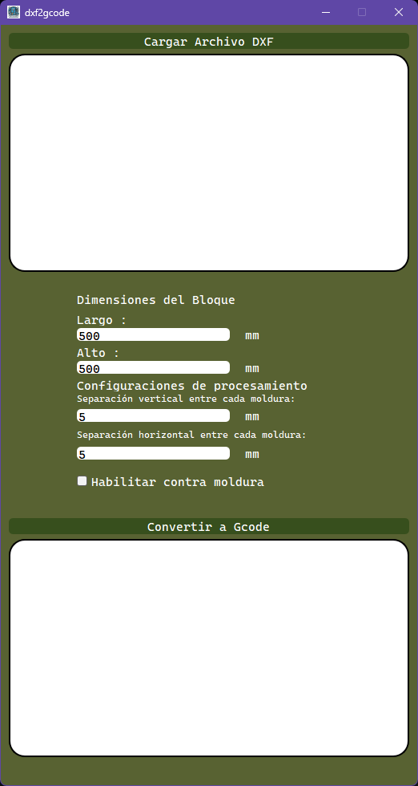
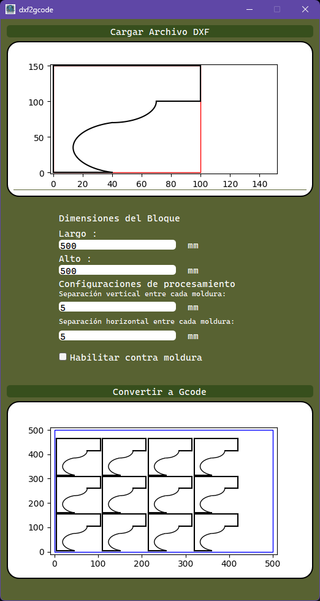
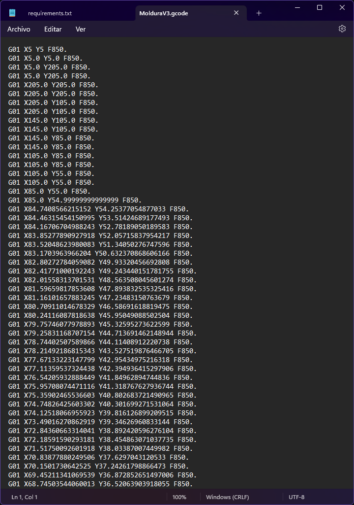
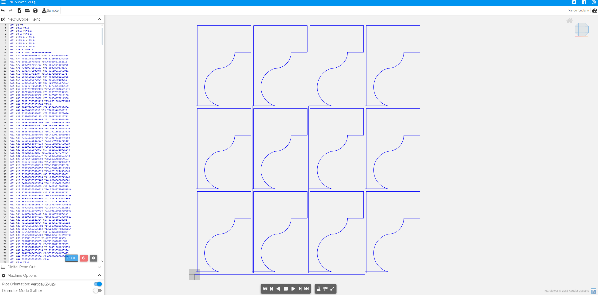

# DXF to G-code Converter

## Descripción
Este proyecto presenta una herramienta especializada en la conversión de archivos DXF en 2D a G-code, desarrollada de manera exclusiva para respaldar un proyecto de tesis enfocado en una máquina cortadora de molduras en bloques de unicel mediante un alambre caliente.

La singularidad de la máquina, que utiliza un alambre móvil de un lado a otro, impide el uso de generadores de G-code convencionales. A diferencia de otras máquinas que pueden levantar o retirar la herramienta para moverse libremente, esta máquina en particular requería un enfoque diferente para evitar cortes en el centro que arruinarían el proceso completo.

Este código se comparte con la comunidad para ayudar a aquellos que trabajan en proyectos de CNC similares, proporcionando una guía detallada sobre cómo generar código G teniendo en cuenta las limitaciones específicas de la máquina.

La herramienta permite cargar un archivo DXF, especificar dimensiones, es decir, un área determinada, y ajustar parámetros de empaquetado como la separación entre cortes. Posteriormente, genera un archivo G-code listo para ser utilizado en la máquina CNC diseñada para este propósito.

## Características
- Carga archivos DXF y proporciona una vista previa del contenido.
- Permite la especificación precisa de las dimensiones del bloque y ajuste de separaciones horizontal y vertical.
- Convierte las entidades del archivo DXF en G-code, asegurando un empaquetado eficiente de los bloques.
- Estas características hacen que la herramienta sea indispensable para aquellos que buscan generar código G de manera precisa y eficiente para la máquina CNC diseñada con este propósito.

## Requisitos
- Python 3.x
- PyQt5
- ezdxf
- Matplotlib
- Numpy

## Instrucciones de Uso
1. Clona este repositorio: `git clone https://github.com/AVM4ST3R/dxf2gcode.git` 
2. Instala las dependencias: `pip install -r requirements.txt`
3. Ejecuta la aplicación: `python main_dxf2gcode.py`

## Capturas de Pantalla

## Contribuciones
Las contribuciones son bienvenidas. Si encuentras algún problema o tienes una mejora, ¡no dudes en abrir un problema o enviar un pull request!

